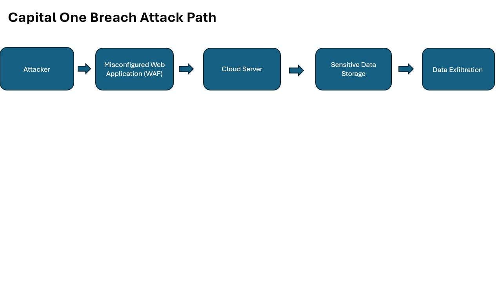

# Capital One Cloud Security Governance Risk Analysis 

Cloud Security Governance and Risk Analysis of the 2019 Capital One Breach. This case study evaluates cloud configuration risks, IAM control failures, and governance gaps using cybersecurity risk management principles.

## Project Overview 

This case study was conducted to:

- Analyze the root cause of the 2019 Capital One cybersecurity breach 
- Identify governance and cybersecurity risk management failures 
- Evaluate security control gaps in cloud infrastructure
- Recommend improvements to organizational security posture

## Incident Summary 

- The Capital One cybersecurity breach occurred in 2019 and affected over 100 million indivdiuals 
- The attacker exploited a misconfigured web application firewell (WAF) within the company's cloud environment
- The vulnerability allowed unauthorized access to sensitive data stores in the cloud infrastructure
- Exposed data included customer names, addresses, credit scores, credit limits, balances, and other financial information
- The incident highlighted significant weakness in cloud configuration management, identity access control, and monitoring practices

## Root Cause Analysis 

The following table identifies the primary control failures and governance weaknesses that contributed to the Capital One Breach 

| Security Area | Control Failure | Risk Impact | 
|---------------|-----------------|-------------|
| Cloud Configuration | Misconfigured Web application firewall allowed unauthorized access to cloud resoources | Sensitive customer data was exposed due to improper cloud configuration management | 
| Identify & Access Management (IAM) | Overly permissive IAM allowed the attacker to access sensitive storage resources | Weak access controls increased the risk of data exposure | 
| Security Monitoring | Insufficent monitoring and logging delayed detection of the atackers activity | Lack of visibility allowed the attacker to access data without immediate detection | 
| Governance & Risk Management | Inadequate cloud security governance and configuration auditing | Weak oversight increased the likelihood of configuration-related vulnerabilites | 

## Cyber Risk Register  

The following cyber risks register identifies key security risks revealed by the Capital One breach and outline potential mitigation strategies

| Risk | Likelihood | Impact | Control Gap | Recommend Mitigation | 
|------| -----------|--------|-------------|----------------------|
| Cloud Misconfiguration | High | High | Weak cloud configuration management allowed firewall misconfiguration | Implement continous cloud configuration monitoring and automated security auditing | 
| Excessive IAM Permissions | High | High | Overly permissive access roles allowed attacker access to sensitive storage resources | Enforce least privilege access policies and regular IAM permission reviews | 
| Insufficient Security Monitoring | Medium | High | Lack of effective monitoring delayed detection of malicious activity | Deploy centralized logging and real-time security monitoring tools | 
| Weak Cloud Governance | Medium | High | Inadequate oversight of cloud security policies and configuration auditing | Establish stronger cloud governance policies and regular security complaince assesments |

## Governance & Security Recommendations 

The following recomendations outline key governance and security improvements that organizations should implement to reduce the risk of similar cloud security incidents 

- Implement stronger cloud configuration management and continous security auditing to prevent misconfigured cloud resources
- Enforce least privilege access policies to ensure users and services only have the minimumn permission required
- Deploy centralized logging and real-time security monitoring tools to detect suspicious activity more quickly
- Establish stronger cloud security governance policies and regular assessments to ensure security standards are maintained 

## Attack Path Diagram 

The following diagram illustrates the attack path used in 2019 Capital One cloud breach

## NIST Cybersecurity Framework Mapping 

The Capital One breach exposed several failures across the NIST Cybersecurity Framework functions. The table below maps the identified security failures to the relevant NIST CSF Categories 

| NIST CSF Function | Security Gap Identified | Example From Beach | 
|-------------------|-------------------------|--------------------|
| Identity | Weak cloud governance and risk oversight | Lack of configuration auditing and risk assessment for cloud infrastructure |
| Protect | Overly permissive IAM roles | Excessive access permissions allowed attacker to access storage resources | 
| Detect | Insufficent monitoring and logging | Security teams did not immediately detect suspicious activity | 
| Respond | Delayed incident detection | Attack activity persisted before being discovered | 
| Recover | Need for stronger cloud governance policies | Organization requires improved cloud security and auditing |
